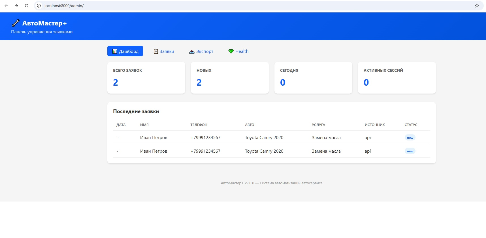
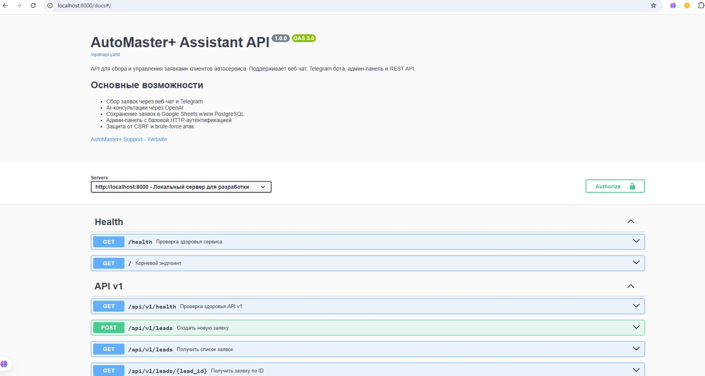

# AutoMaster+ Assistant

Система автоматизации записи клиентов для автосервисов. Приём заявок через REST API и веб-чат, хранение в PostgreSQL, админ-панель с управлением заявками.

[](https://www.python.org/)
[](https://flask.palletsprojects.com/)
[](https://www.postgresql.org/)
[](https://www.docker.com/)

---

## Содержание

- [Скриншоты](#скриншоты)
- [Стек](#стек)
- [Быстрый старт](#быстрый-старт)
- [API](#api)
- [Структура проекта](#структура-проекта)
- [Что я сделал](#что-я-сделал)
- [Ограничения и известные проблемы](#ограничения-и-известные-проблемы)
- [Контакты](#контакты)

---

## Скриншоты

| Админ-панель | API документация |
|-------------|------------------|
|  |  |

---

## Стек

| Компонент | Технология |
|-----------|------------|
| Язык | Python 3.13 |
| Веб-фреймворк | Flask 3.0 + Gunicorn |
| База данных | PostgreSQL 16 + SQLAlchemy 2.0 |
| Кеш | Redis 7 |
| Прокси | Nginx |
| Контейнеризация | Docker + Docker Compose |
| Тестирование | pytest |
| Форматирование | Black, Ruff |

---

## Быстрый старт

### Локальный запуск

```bash
# Клонировать
git clone https://github.com/godlesscreator/automaster-assistant_pred_prod.git
cd automaster-assistant_pred_prod

# Виртуальное окружение
python -m venv .venv
.venv\Scripts\activate  # Windows
# source .venv/bin/activate  # Linux/Mac

# Зависимости
pip install -r requirements.txt

# Настройка
cp .env.example .env
# Отредактируйте .env: FLASK_SECRET_KEY, ADMIN_PASSWORD

# Запуск
python main.py
```

Откройте: [http://localhost:8000](http://localhost:8000)

### Запуск через Docker

```bash
docker compose up -d --build

# Проверка
curl http://localhost:8000/health
```

| Сервис | Порт | Назначение |
|--------|------|------------|
| `app` | 8000 | Flask + Gunicorn |
| `db` | 5432 | PostgreSQL 16 |
| `redis` | 6379 | Redis 7 |
| `nginx` | 80/443 | Reverse proxy |

---

## API

| Метод | Эндпоинт | Описание |
|-------|----------|----------|
| `GET` | `/` | Информация о сервисе |
| `GET` | `/health` | Health check |
| `GET` | `/api/v1/health` | Health check API v1 |
| `POST` | `/api/v1/leads` | Создать заявку |
| `GET` | `/api/v1/leads` | Список заявок |
| `GET` | `/api/v1/leads/{id}` | Заявка по ID |
| `PATCH` | `/api/v1/leads/{id}/status` | Обновить статус |
| `GET` | `/api/v1/stats` | Статистика |
| `POST` | `/webchat` | Веб-чат (отправить сообщение) |
| `GET` | `/admin/` | Админ-панель |
| `GET` | `/admin/leads` | Список заявок (JSON) |
| `GET` | `/admin/export` | Экспорт заявок в CSV |

Полная спецификация: [`openapi.yaml`](openapi.yaml)

---

## Структура проекта

```
bot_assistant_prod/
├── bot_assistant/              # Основной пакет
│   ├── handlers/               # Обработчики запросов
│   │   ├── api_v1.py           # REST API v1
│   │   ├── telegram_bot.py     # Telegram бот (изучен, не используется в РФ)
│   │   ├── web_chat.py         # Веб-чат
│   │   ├── admin_panel.py      # Админ-панель
│   │   └── docs.py             # Документация
│   ├── services/               # Внешние сервисы
│   │   ├── openai_service.py   # OpenAI (изучен, не используется)
│   │   ├── google_sheets.py    # Google Sheets (изучен, не используется)
│   │   └── telegram_notifier.py # Уведомления (изучены, не используются)
│   ├── models/                 # Модели данных
│   ├── templates/              # HTML шаблоны
│   ├── config.py               # Конфигурация
│   ├── di.py                   # DI-контейнер
│   ├── database.py             # PostgreSQL
│   ├── db_models.py            # SQLAlchemy модели
│   ├── repository.py           # Паттерн Repository
│   ├── redis_client.py         # Redis клиент
│   ├── security.py             # CSRF, аутентификация
│   ├── validators.py           # Валидация
│   ├── middleware.py           # WSGI middleware
│   ├── circuit_breaker.py      # Circuit Breaker (изучен)
│   ├── retry.py                # Retry-механизм (изучен)
│   ├── async_utils.py          # Асинхронные утилиты
│   ├── errors.py               # Кастомные ошибки
│   └── logger.py               # Логирование
├── alembic/                    # Миграции БД
├── tests/                      # Тесты (10 файлов)
├── screenshots/                # Скриншоты
├── ssl/                        # SSL сертификаты
├── main.py                     # Точка входа
├── Dockerfile
├── docker-compose.yml
├── nginx.conf
├── openapi.yaml
├── pyproject.toml
├── requirements.txt
├── .env.example
└── LICENSE
```

---

## Что я сделал

- Спроектировал REST API с документацией Swagger для интеграции с сайтами и агрегаторами
- Создал админ-панель, где мастер видит заявки без моего участия
- Настроил Docker-инфраструктуру: приложение + база + кеш + прокси работают из одной команды
- Реализовал валидацию данных (телефон, дата) — защита от ошибок клиентов
- Написал тесты для критичных компонентов (API, валидация, конфигурация)

---

## ⚠️ Ограничения и известные проблемы

| Компонент | Статус | Примечание |
|-----------|--------|------------|
| Telegram-бот | ❌ Не работает в РФ | Требуется VPN/proxy, не рекомендуется для российской аудитории |
| OpenAI-интеграция | ⚠️ Тестовая | Не использовалась с реальными клиентами, требует API-ключ |
| Google Sheets | ⚠️ Fallback | Работает, но PostgreSQL предпочтительнее |
| Тесты | ⚠️ Частичные | Некоторые тесты требуют доработки и актуализации |
| Circuit Breaker / Retry | 📐 Экспериментальные | Реализованы для изучения паттернов, не обкатаны |

**Это учебный проект.** В production-условиях я бы упростил архитектуру, убрал неиспользуемые интеграции и сфокусировался на веб-форме записи + админ-панели.

---

## Контакты

- GitHub: [godlesscreator](https://github.com/godlesscreator)
- Проект: [github.com/godlesscreator/automaster-assistant_pred_prod](https://github.com/godlesscreator/automaster-assistant_pred_prod)